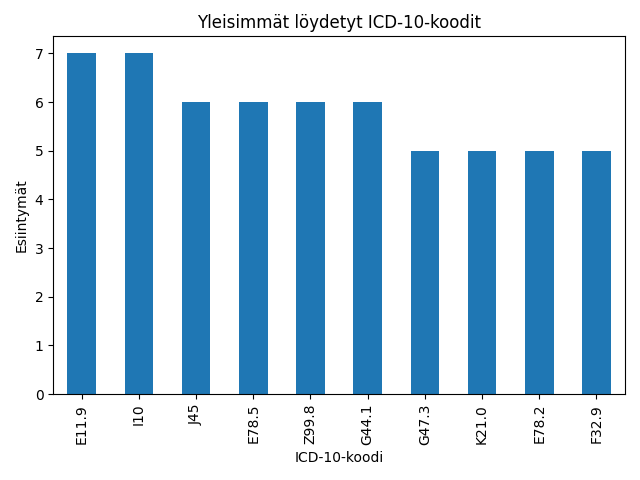

# ICD-10 Text Extraction & Fuzzy Search Demo

Tämä projekti on kevyt ja selkeä demonstraatio ICD-10-tautiluokkien tunnistamisesta vapaasta tekstistä Pythonilla. Mukana sekä **suora koodin poiminta** tekstistä (regex), että **fuzzy-haku** (epäselvät termit/diagnositekstit).

Soveltuu **sairauskertomusten automaattiseen kooditukseen**, tietopyyntöihin ja opetustarkoituksiin. Projektin voi ajaa paikallisesti ja siinä käytetään vain avoimen lähdekoodin kirjastoja.

---

## 🔍 **Ominaisuudet**

- **Regex-pohjainen haku:** Tunnistaa kaikki tekstissä esiintyvät ICD-10-koodit ja antaa niiden selitteet.
- **Fuzzy matching:** Löytää lähimmät ICD-10-koodit vapaamuotoisille (englanninkielisille) termeille.
- **Streamlit-käyttöliittymä:** Helppo testata suoraan selaimessa.
- **Datan analyysi ja visualisointi:** Yleisimmät koodit sample-datasta (katso output/).

---

## 📦 **Asennus**

1. **Kloonaa repo ja siirry kansioon**
2. **Asenna riippuvuudet:**
    ```bash
    pip install -r requirements.txt
    ```
3. **Varmista, että hakemistossa on tiedosto `data/icd10_codes.csv`**  
   _(CSV: https://github.com/k4m1113/ICD-10-CSV)_

4. **Käynnistä Streamlit UI:**
    ```bash
    streamlit run src/app.py
    ```

5. **(Valinnainen) Aja analyysiskriptit:**
    ```bash
    python src/analyze_codes.py
    ```

---

## 🧑‍💻 **Käyttö**

- Syötä potilasteksti (tai diagnoosilista) tekstikenttään → saat listan löytyneistä ICD-10-koodeista ja selitteistä.
- Syötä vapaa hakutermi (englanniksi) → saat parhaat “fuzzy”-osumat ICD-10-koodistoon.

---

## 🛠️ **Rakenne**

├── data/
│ ├── icd10_codes.csv # ICD-10 koodisto (CSV, ei mukana tässä repoissa)
│ └── sample_texts.txt # Esimerkkitekstejä (voit luoda lisää)
├── output/
│ └── top_icd10_codes.png # Visualisointi: yleisimmät koodit
├── src/
│ ├── app.py # Streamlit UI
│ ├── analyze_codes.py # Analyysit ja visualisoinnit
│ └── extractor.py # (vaihtoehtoinen: pelkkä tekstin purku konsolissa)
├── requirements.txt
└── README.md


---

## 📊 **Esimerkkikuva**



---

## 💡 **Jatkokehitysideoita**

- Lauseentason NER-mallit (esim. Hugging Face, ClinicalBERT)
- Kielituen parantaminen suomeksi
- Integrointi potilastietojärjestelmään
- Käyttöliittymän ja visualisointien laajennus

---

## 👤 **Tekijä**

Lauri Virtanen, 2025  

---

**Huom!** Projekti käyttää esimerkkidataa (MIMIC-III/ICD10), ei sisällä henkilötietoja.